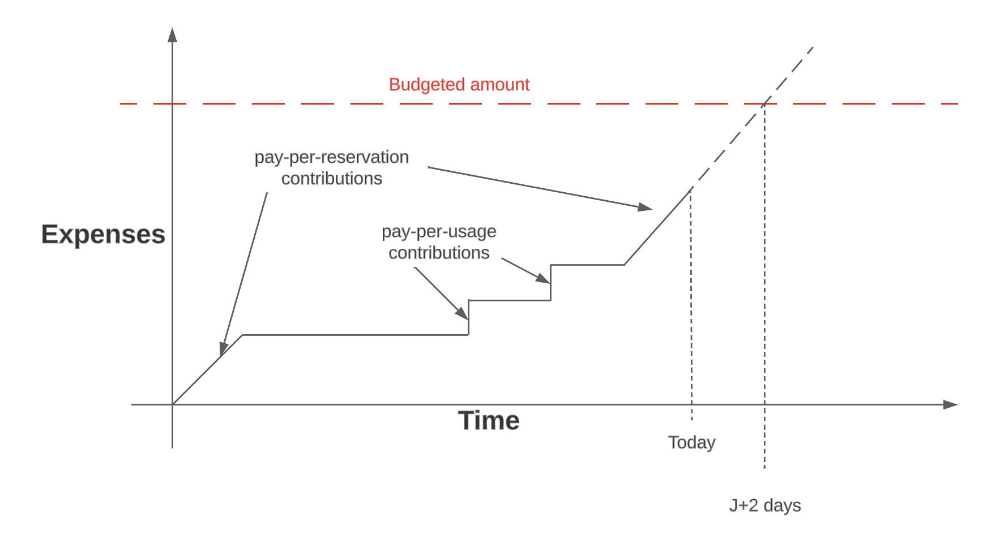

# Budgets

All budget amounts defined in this library are using ¢ unit and are monthly budgets, following AWS billing periods.
In order to accuratly reflect accrued costs, two values are persisted throughout the month in the common DynamoDB cost table:
- accrued expenses, reflecting usage of a pay-per-use resource (think serverless pricing model - Lambda, API Gateway, SQS...)
- inccured expenses rate, reflecting usage of a reserved resource (think traditional pricing model - VPC, EC2, RDS...)

### Accrued expenses

Saved within the `accruedExpenses` field in each budget item in DynamoDB. They holds the instant up-to-date expenses for all resources accounting for a specific budget. Updated as frequently as possible. They used [Revantios unit](./revantios.md).

Similar to a position.

### Inccured futur expenses

Saved within the `inccuredExpensesRate` fied in each budget item in DynamoDB. Updated when a time-sensitive expense is added or removed for the stack. The persisted unit is [Revantios](./revantios.md)/second.

Similar to a speed.

## Budget update

### Updates made by resources accounting for a specific budget

Budget updates made to increase `accruedExpenses` and `inccuredExpensesRate` is done using the `ADD` statement from DynamoDB `UpdateExpresion`, within an `UpdateItem` operation. Updated budget is returned to called with the `UPDATED_NEM` clause. Ensures budget update operations are atomic and conflict-free (not performing update operations on client side, but on DynamoDB side directly). Returned budget is used to allow caller to proceed with resource disabling if budget is exceeded.

Budget updates made to decrease `inccuredExpensesRate` is done using the `SET` statement from DynamoDB `UpdateExpresion`, within an `UpdateItem` operation.

All budget updates operations are using `SET` expression to update the `updatedAt` attribue with the ISO datetime representation.

### Updates made by common resources

In order to update `accruedExpenses` with the contribution of `inccuredExpensesRate`, a specific DynamoDB stream is setup on the DynamoDB table to listen for `MODIFY` event whose item (before update) contains a non-null `inccuredExpensesRate`. Time elpased since last update is multiplied by previously known `inccuredExpensesRate` to add this amount to `accruedExpenses`. To prevent recursive loop, `updateAt` attribute is not updated by this process.

> DynamoDB equivalent update expression: `ADD accruedExpenses (newItemUpdatedAt - oldItemUpdatedAt) * oldItemInccuredExpensesRate`

An EventBridge one-time Schedule is setup/updated for each budget (using the address as the Schedule name). The target date for the schedule is computed during the DynamoDB stream consumption to predict date and time accrued expenses will be equal to budget amount.

The schedule triggers a dedicated Lambda function responsible for disabling resources contributing to this specific budget last known `inccuredExpensesRate`.